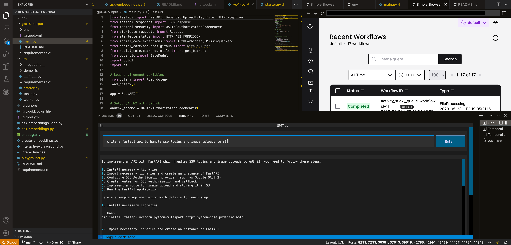

# Gitpod and Temporal Demo w/ GPT-4



A demo using Gitpod and Temporal to demonstrate GPT-4 coding assistant workflows. 

_tldr; adds the text from webpages to augment GPT-4's knowledge of the question you want to ask_

Builds a Pinecone vector database index to augment queries to GPT-4, based loosely on [this link](https://github.com/openai/openai-cookbook/blob/main/examples/vector_databases/pinecone/GPT4_Retrieval_Augmentation.ipynb), but with the data pipeline running in Temporal.

The vector database can then be used to add your data / context to your prompt, adding your knowledge to what GPT-4 has as context.

[](https://gitpod.io/#https://github.com/burningion/demo-gitpod-temporal)

# Setup

You'll need to make sure the following environment variables are set in Gitpod:

- `OPENAI_API_KEY` - OpenAI API key, grab one from [here](https://platform.openai.com/overview)
- `PINECONE_API_KEY` - Pinecone API key, grab one from [here](https://www.pinecone.io/)
- `PINECONE_ENVIRONMENT` - Pinecone environment, you'll have this after you create an index. (Should be something like `us-east4-gcp`)
- `PINECONE_INDEX` - The name of your actual Pinecone index
- `PROTOCOL_BUFFERS_PYTHON_IMPLEMENTATION` - Set this to `python`, as it's needed because of a gRPC bug

With these environment variables set, you're ready to run the application.

# Running the Retrieval Augmentation  workflow

This example workflow scrapes a set of webpages from the Gitpod website, looking to steer GPT-4 with augmented data as to how to build a Gitpodified project.

It uses Pinecone as our Vector database, so you'll need to create a database with `1536` dimensions with `dotproduct` as the engine in order to run GPT-4 embeddings.

The free tier of Pinecone works well enough to run this example.

To run the Temporal workers you'll need to run the following:

```bash
$ cd src
$ python3 worker.py
```

In another terminal, you can create and send the jobs to the workers with the starter:

```bash
$ cd src
$ python3 starter.py
```

Check the output by going to port `8233` in Gitpod, you'll see your workflows executing.

If you want to add your own URLs, look at the list of URLs at the beginning of the `starter.py` file.

# Running Augmented Inference 

Once you've created your knowledge base by running your Temporal Workflows, you can then query your augmented GPT-4 assisstant:

```bash
$ python3 ask-embeddings.py
```

There's more in the accompanying blog post. 

Otherwise, you can see the example output in the [gpt-4-output](gpt-4-output/) directory.

# Running an Interactive Agent

There's an interactive version of the GPT-4 API running by default in this repo. It's called `interactive-playground.py`.  

You can use this to query GPT-4 via the API and keep track of the questions you ask over time.